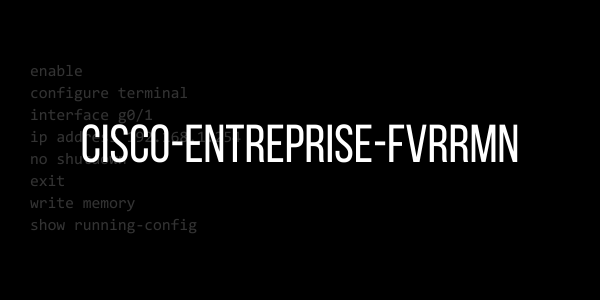
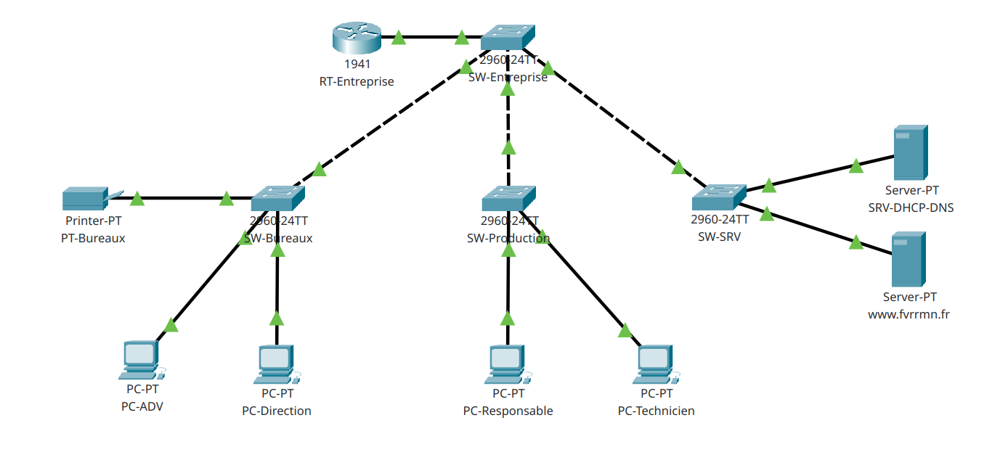
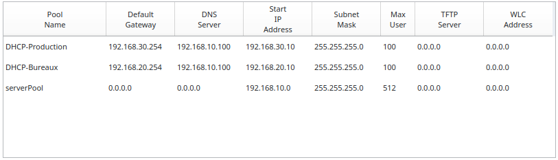
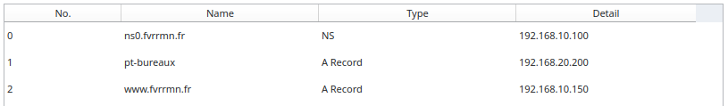
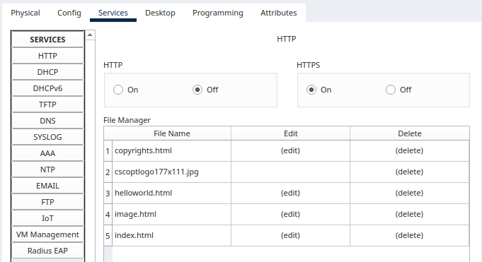
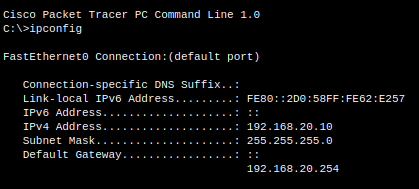
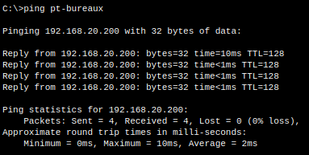
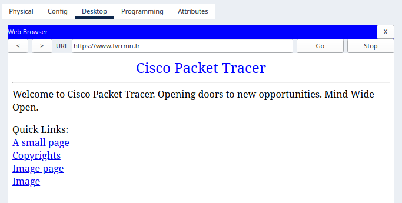
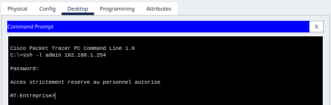

# cisco-entreprise-fvrrmn
*Simulation d'une entreprise fictive avec Cisco Packet Tracer*


<div style="text-align:center">



*Image protégée – Propriété exclusive*

</div>

## Introduction

Concevoir un réseau d’entreprise fonctionnel, sécurisé et évolutif, capable de répondre aux besoins actuels et futurs, avec les caractéristiques suivantes :

- Architecture modulable et évolutive, facilitant l’intégration de nouvelles fonctionnalités et services.
- Segmentation du réseau via VLAN afin d’isoler les différents services pour améliorer la sécurité et la performance.
- Attribution automatique des adresses IP par DHCP pour simplifier la gestion des périphériques réseau.
- Accès sécurisé aux services internes, notamment au serveur Web, via des protocoles chiffrés et des mécanismes d’authentification appropriés.


## Sommaire

1. [Tableau d’adressage IP](#1-tableau-dadressage-ip)  
2. [Tableau des interconnexions](#2-tableau-des-interconnexions)  
3. [Schéma de l'infrastructure réseau](#3-schéma-de-linfrastructure-réseau)  
4. [Configuration du routeur : RT-Entreprise](#4-configuration-du-routeur--rt-entreprise)  
5. [Configuration du switch principal : SW-Entreprise](#5-configuration-du-switch-principal--sw-entreprise)  
6. [Configuration d’un switch secondaire : SW-Bureaux](#6-configuration-dun-switch-secondaire--sw-bureaux)  
7. [Mise en place du serveur DHCP/DNS](#7-mise-en-place-du-serveur-dhcpdns)  
8. [Mise en place du serveur Web](#8-mise-en-place-du-serveur-web)  
9. [Tests de conformité](#9-tests-de-conformité)  
10. [Sécurité mise en place](#10-sécurité-mise-en-place)  

---

## 1. Tableau d'adressage IP

| Équipement    | Interface | VLAN | IP             | Rôle                 |
|:-------------:|:---------:|:----:|:--------------:|:--------------------:|
| RT-Entreprise | G0/1.10   | 10   | 192.168.10.254 | Routeur – Serveurs   |
| RT-Entreprise | G0/1.20   | 20   | 192.168.20.254 | Routeur – Bureaux    |
| RT-Entreprise | G0/1.30   | 30   | 192.168.30.254 | Routeur – Production |
| SRV-DHCP-DNS  | –         | 10   | 192.168.10.100 | DHCP, DNS            |
| SRV-Web       | –         | 10   | 192.168.10.150 | Web interne          |
| PC Bureaux    | –         | 20   | DHCP           | Utilisateur          |
| Imprimante    | –         | 20   | 192.168.20.200 | Fixe                 |
| PC Production | –         | 30   | DHCP           | Utilisateur          |


## 2. Tableau des interconnexions

| Équipement        | Port        | Connecté à      | Port        |
|:-----------------:|:-----------:|:---------------:|:-----------:|
| RT-Entreprise     | G0/1        | SW-Entreprise   | G0/1        |
| SW-Entreprise     | Fa0/22      | SW-SRV          | Fa0/22      |
| SW-Entreprise     | Fa0/23      | SW-Bureaux      | Fa0/23      |
| SW-Entreprise     | Fa0/24      | SW-Production   | Fa0/24      |
| SW-SRV            | Fa0/1       | SRV-DHCP-DNS    | Fa0         |
| SW-SRV            | Fa0/2       | SRV-Web         | Fa0         |
| SW-Bureaux        | Fa0/1       | PC-Direction    | Fa0         |
| SW-Bureaux        | Fa0/2       | PC-ADV          | Fa0         |
| SW-Bureaux        | Fa0/15      | PT-Bureaux      | Fa0         |
| SW-Production     | Fa0/1       | PC-Responsable  | Fa0         |
| SW-Production     | Fa0/2       | PC-Technicien   | Fa0         |

## 3. Schéma de l'infrastructure réseau

<div style="text-align:center">



</div>

## 4. Configuration du routeur : RT-Entreprise

### 4.1 Définir le nom de l'appareil

Nommer l’équipement permet de l’identifier facilement dans la console, les logs et la documentation.
```Cisco
hostname RT-Entreprise
```

### 4.2 Définir le Message Of The Day (MOTD)

Affiche un message d’avertissement aux utilisateurs avant la connexion pour signaler que l’accès est restreint.
```Cisco
banner motd #Acces strictement reserve au personnel autorise#
```

### 4.3 Sécuriser les accès

Protège l’accès local à l’équipement.
```Cisco
line con 0
 password 7 08314D5D1A0E0A0516460F0B24382B2436
 login
```

Protège l’accès aux commandes critiques du routeur.
```Cisco
enable secret 5 $1$mERr$KpDNhaFic857z349Y4rwe0
```

Sécurise l’administration à distance en utilisant SSH et l’authentification locale.
```Cisco
line vty 0 4
 password 7 08314D5D1A0E0A0516461A1033
 login local
 transport input ssh
```

Crée un compte utilisateur local.
```Cisco
username admin secret 5 $1$mERr$WvpwG7ch8Q6nO8OEeAzMr0
```

### 4.4 Configurer les interfaces

Interface inutilisée, désactivée pour limiter les risques.
```Cisco
interface GigabitEthernet0/0
 no ip address
 duplex auto
 speed auto
 shutdown
```

Interface connectée au switch principal, configurée avec une IP pour le routage interne.
```Cisco
interface GigabitEthernet0/1
 description Lien LAN vers SW-Entreprise
 ip address 192.168.1.254 255.255.255.0
 ip nat inside
 duplex auto
 speed auto
```

Interface VLAN 10 pour les Serveurs, permet le routage et le relais DHCP.
```Cisco
interface GigabitEthernet0/1.10
 description Lien VLAN 10 Serveurs
 encapsulation dot1Q 10
 ip address 192.168.10.254 255.255.255.0
 ip helper-address 192.168.10.100
```

Interface VLAN 20 pour le service Bureaux, permet le routage et le relais DHCP.
```Cisco
interface GigabitEthernet0/1.20
 description Lien VLAN 20 Bureaux
 encapsulation dot1Q 20
 ip address 192.168.20.254 255.255.255.0
 ip helper-address 192.168.10.100
```

Interface VLAN 30 pour le service Production, permet le routage et le relais DHCP.
```Cisco
interface GigabitEthernet0/1.30
 description Lien VLAN 30 Production
 encapsulation dot1Q 30
 ip address 192.168.30.254 255.255.255.0
 ip helper-address 192.168.10.100
 ```

## 5. Configuration du switch principal : SW-Entreprise

### 5.1 Définir le nom de l'appareil

Nommer l’équipement permet de l’identifier facilement dans la console, les logs et la documentation.
```Cisco
hostname SW-Entreprise
```

### 5.2 Définir le Message Of The Day (MOTD)

Affiche un message d’avertissement aux utilisateurs avant la connexion pour signaler que l’accès est restreint.
```Cisco
banner motd #Acces strictement reserve au personnel autorise#
```

### 5.3 Sécuriser les accès

Protège l’accès local à l’équipement.
```Cisco
line con 0
 password 7 08314D5D1A0E0A0516460F0B24382B2436
 login
```

Protège l’accès aux commandes critiques du routeur.
```Cisco
enable secret 5 $1$mERr$KpDNhaFic857z349Y4rwe0
```

Protège l'accès à distance.
```Cisco
line vty 0 4
 password 7 08314D5D1A0E0A0516461A1033
 login
line vty 5 15
 password 7 08314D5D1A0E0A0516461A1033
 login
```

### 5.4 Configurer les interfaces

Interfaces inutilisées, désactivées pour limiter les risques.
```Cisco
interface range fa0/1-21
 shutdown
```

Interface associée au VLAN 10
```Cisco
interface FastEthernet0/22
 switchport access vlan 10
 switchport mode access
```

Interface associée au VLAN 20
```Cisco
interface FastEthernet0/23
 switchport access vlan 20
 switchport mode access
```

Interface associée au VLAN 30
```Cisco
interface FastEthernet0/24
 switchport access vlan 30
 switchport mode access
```

Le port G0/1 transporte toutes les communications entre le switch et le routeur pour les VLANS 10, 20 et 30.
```Cisco
interface GigabitEthernet0/1
 switchport trunk allowed vlan 10,20,30
 switchport mode trunk
```

## 6. Configuration d'un switch secondaire : SW-Bureaux

### 6.1 Définir le nom de l'appareil

Nommer l’équipement permet de l’identifier facilement dans la console, les logs et la documentation.
```Cisco
hostname SW-Bureaux
```

### 6.2 Définir le Message Of The Day (MOTD)

Affiche un message d’avertissement aux utilisateurs avant la connexion pour signaler que l’accès est restreint.
```Cisco
banner motd #Acces strictement reserve au personnel autorise#
```

### 6.3 Sécuriser les accès

Protège l’accès local à l’équipement.
```Cisco
line con 0
 password 7 08314D5D1A0E0A0516460F0B24382B2436
 login
```

Protège l’accès aux commandes critiques du routeur.
```Cisco
enable secret 5 $1$mERr$KpDNhaFic857z349Y4rwe0
```

Protège l'accès à distance.
```Cisco
line vty 0 4
 password 7 08314D5D1A0E0A0516461A1033
 login
line vty 5 15
 password 7 08314D5D1A0E0A0516461A1033
 login
```

### 6.4 Configurer les interfaces

Interface associée au VLAN 20
```Cisco
interface FastEthernet0/1
 switchport access vlan 20
 switchport mode access
```

Interface associée au VLAN 20
```Cisco
interface FastEthernet0/2
 switchport access vlan 20
 switchport mode access
``` 

Interfaces inutilisées, désactivées pour limiter les risques.
```Cisco
interface range fa0/3-14
 shutdown
```

Interface associée au VLAN 20
```Cisco
interface FastEthernet0/15
 switchport access vlan 20
 switchport mode access
```

Interfaces inutilisées, désactivées pour limiter les risques.
```Cisco
interface range fa0/15-22
 shutdown
```

Interface associée au VLAN 20
```Cisco
interface FastEthernet0/23
 switchport access vlan 20
 switchport mode access
 ```

Interface inutilisée, désactivée pour limiter les risques.
```Cisco
interface FastEthernet0/24
 shutdown
```

Interface inutilisée, désactivée pour limiter les risques.
```Cisco
interface range G0/1-2
 shutdown
```

## 7. Mise en place du serveur DHCP/DNS

Nous avons créé un pool d’adresses distinct pour chaque VLAN, garantissant que chaque segment réseau reçoive automatiquement des adresses IP dans sa plage dédiée. Cette configuration simplifie la gestion des adresses et réduit les risques de conflits.

<div style="text-align:center">



</div>

Le serveur DNS interne a été configuré pour résoudre les noms des périphériques et des services internes, permettant aux utilisateurs d’accéder facilement aux ressources réseau sans mémoriser les adresses IP.

<div style="text-align:center">



</div>

## 8. Mise en place du serveur Web

Le service HTTP a été volontairement mis hors service (Off), afin d’empêcher tout accès non sécurisé.

Le service HTTPS a été activé (On), permettant ainsi aux utilisateurs d’accéder à l’interface Web via un canal chiffré TLS/SSL.

<div style="text-align:center">



</div>

## 9. Tests de conformité

Vérification de l’attribution automatique d’une adresse IP pour PC-Direction sur le VLAN 20. (Plage 10-100)

<div style="text-align:center">



</div>

Vérification de la résolution DNS pour accéder à l’imprimante par son nom.

<div style="text-align:center">



</div>

Vérification de l’accès au site Web interne via HTTPS.

<div style="text-align:center">



</div>

Vérification de l’accès SSH pour l’administration à distance.

<div style="text-align:center">



</div>

## 10. Sécurité mise en place

Plusieurs mécanismes de protection ont été intégrés dès la conception du réseau :

- Mots de passe sécurisés : Accès console, VTY et mode privilégié protégés par des mots de passe chiffrés.
- Filtrage des interfaces inutilisées : Les ports non utilisés sont placés en état shutdown afin de réduire la surface d'attaque.
- Segmentation par VLAN : Chaque service est isolé pour limiter la propagation d'éventuelles menaces et mieux contrôler les flux inter-VLAN.
- HTTPS uniquement : Le serveur Web interne n'accepte que des connexions chiffrées TLS/SSL.
- Accès à distance SSH : L'administration des équipements se fait exclusivement en SSH, garantissant la confidentialité des identifiants et des commandes.

---

<p align="center" style="margin-top:30px;">
  <a href="#cisco-entreprise-fvrrmn" style="font-size:28px; text-decoration:none;">⬆️ Retour ⬆️</a>
</p>